Office of Institutional Research and Effectiveness

## A. General Information A0. Respondent Information

Office: Address: City: State: Zip: Country: Phone Number:
Email Address:

| Office of Institutional Research and Effectiveness P.O. Drawer EY Mississippi State Mississippi 39762 United States 662-325-3920 oir@ir.msstate.edu |
| --------------------------------------------------------------------------------------------------------------------------------------------------- |

Are your responses to the CDS posted for reference on your institution's website?

Yes If yes, please provide a direct link to the posted CDS responses:
https://ir.msstate.edu/cdsets.php

A1. Address Information

Please enter general institution information below:

Name of College or University **Mississippi State University**

Street Address: **75 B.S. Hood Road**

City: **Mississippi State**

State: **Mississippi** Zip: **39762**

Country: **United States** Main Institution Phone Number: **662-325-2323**

Main Institution Website: **https://www.msstate.edu/**

Please enter Admissions Office information below:

Street Address: **25 Old Main** City: **Mississippi State**

State: **Mississippi** Zip: **39762**

Country: **United States** Admissions Phone Number: **662-325-2224** Admissions Website: **https://www.admissions.msstate.edu/** Admissions Email Address: **admit@msstate.edu**

Is there a separate URL for your school's online application? If yes, please specify:
https://apply.msstate.edu If you have a mailing address other than the one listed above to which applications should be sent, please provide:
P.O. Box 6334 Mississippi State Mississippi 39762 A2. Source of Institutional Control: _(click to select from dropdown)_
Public A3. Classify your undergraduate institution: _(click to select from dropdown)_
Coeducational A4. Academic year calendar: _(click to select from dropdown)_
Semester A5. Degrees offered by your institution _(select all that apply)._
Certificate Master's Diploma Post-Master's certificate Associate Doctoral degree - research/scholarship Terminal Doctoral degree - professional practice Transfer Doctoral degree - other Bachelor's Post-Bachelor's certificate A6. Diversity, Equity, and Inclusion If you have a diversity, equity, and inclusion office or department, please provide the URL of the corresponding Web page:
https://www.oidi.msstate.edu/

## B. Enrollment And Persistence

B1. Institutional Enrollment Provide numbers of students for each of the following categories as of the institution's official fall reporting date or as of **October 15, 2023**.

| Men                                                   | Women         | Another Gender |            |            |            |     |
| ----------------------------------------------------- | ------------- | -------------- | ---------- | ---------- | ---------- | --- |
| Full Time                                             | Part Time     | Full Time      | Part Time  | Full Time  | Part Time  |     |
| Enrollment                                            | Enrollment    | Enrollment     | Enrollment | Enrollment | Enrollment |     |
| UNDERGRADUATE STUDENTS                                |               |                |            |            |            |     |
| Degree-seeking, first-time, first-year students       | 1,673         | 9              | 2,059      | 10         | 0          | 0   |
| Other first-year, degree-seeking students             | 823           | 79             | 765        | 82         | 0          | 0   |
| All other degree-seeking undergraduate students       | 5,369         | 756            | 5,640      | 573        | 0          | 0   |
| Total degree-seeking undergraduate students           | 7,865         | 844            | 8,464      | 665        | 0          | 0   |
| All other undergraduates enrolled in credit courses   | 144           | 87             | 110        | 51         | 0          | 0   |
| Total Undergraduate Students                          | 8,009         | 931            | 8,574      | 716        | 0          | 0   |
| Total part-time undergraduate degree-seeking students | 1,509         |                |            |            |            |     |
| Total full-time undergraduate degree-seeking students | 16,329        |                |            |            |            |     |
| Total of all undergraduate degree-seeking students    | 17,838 18,230 |                |            |            |            |     |
| Total of all undergraduate students enrolled Men      | Women         | Another Gender |            |            |            |     |
| Full Time                                             | Part Time     | Full Time      | Part Time  | Full Time  | Part Time  |     |
| Enrollment                                            | Enrollment    | Enrollment     | Enrollment | Enrollment | Enrollment |     |
| GRADUATE STUDENTS                                     |               |                |            |            |            |     |
| Degree-seeking, first-time                            | 219           | 129            | 270        | 155        | 0          | 0   |
| All other degree-seeking                              | 720           | 865            | 1,067      | 931        | 0          | 0   |
| All other graduates enrolled in credit courses        | 4             | 26             | 3          | 38         | 0          | 0   |
| Total Graduate Students                               | 943           | 1,020          | 1,340      | 1,124      | 0          | 0   |
| Total part-time graduate degree-seeking students      | 2,080         |                |            |            |            |     |
| Total full-time graduate degree-seeking students      | 2,276         |                |            |            |            |     |
| Total of all graduate degree-seeking students         | 4,356         |                |            |            |            |     |
| Total of all graduate students enrolled               | 4,427         |                |            |            |            |     |

B. Enrollment and Persistence Common Data Set 2023-24

## B2. Enrollment By Racial/Ethnic Category

Provide numbers of undergraduate students for each of the following categories as of the institution's official fall reporting date or as of October 15, 2023.

| Degree-seeking Undergraduates                           |                                                                   |        |        |
| ------------------------------------------------------- | ----------------------------------------------------------------- | ------ | ------ |
| (include first-time, firstyear)                         | Total Undergraduates (both degree-seeking and non-degree-seeking) |        |        |
| Degree-seeking,                                         |                                                                   |        |        |
| First-time, First-year                                  |                                                                   |        |        |
| International (nonresidents)                            | 73                                                                | 230    | 238    |
| Hispanic/Latino                                         | 160                                                               | 746    | 761    |
| Black or African American, non-Hispanic                 | 620                                                               | 2,634  | 2,733  |
| White, non-Hispanic                                     | 2,677                                                             | 13,236 | 13,452 |
| American Indian or Alaska Native, non-Hispanic          | 16                                                                | 86     | 87     |
| Asian, non-Hispanic                                     | 56                                                                | 291    | 299    |
| Native Hawaiian or other Pacific Islander, non-Hispanic | 0                                                                 | 7      | 7      |
| Two or more races, non-Hispanic                         | 115                                                               | 472    | 482    |
| Race and/or ethnicity unknown                           | 34                                                                | 136    | 171    |
| Total                                                   | 3,751                                                             | 17,838 | 18,230 |

B3. Persistence / Degrees Number of degrees awarded by your institution from July 1, 2022, to June 30, 2023.

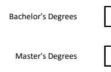

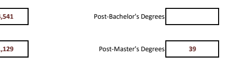

Master's Degrees **1,129** 39 Doctoral degree - research/scholarship 148 93

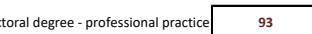

B. Enrollment and Persistence Common Data Set 2023-24

## B4 - B21. Graduation Rates

The items in this section correspond to data elements collected by the IPEDS Web-based Data Collection System's Graduation Rate Survey (GRS).

| For Bachelor's or Equivalent Programs: Please provide data for the Fall 2017 cohort if available. If Fall 2017 cohort data are not available, provide data for the Fall 2016 cohort.                                                                                                                                | 2016 COHORT |       |       |       |
| ------------------------------------------------------------------------------------------------------------------------------------------------------------------------------------------------------------------------------------------------------------------------------------------------------------------- | ----------- | ----- | ----- | ----- |
| Recipients of a Subsidized Stafford Loan, who did not receive a Pell Grant Students who did not receive either a Pell Grant or a subsidized Stafford Loan                                                                                                                                                           |             |       |       |       |
| Recipients of a Federal Pell Grant                                                                                                                                                                                                                                                                                  | Total       |       |       |       |
| A. Initial 2016 cohort of first-time, full-time, bachelor's (or equivalent) degree-seeking undergraduate students                                                                                                                                                                                                   | 1,180       | 535   | 1,902 | 3,617 |
| B. Of the Initial 2016 cohort, how many did not persist and did not graduate for any of the following reasons: (report total allowable exclusions) - Deceased - Permanently Disabled - Armed Forces - Foreign Aid Service of the Federal Government C. Final 2016 cohort , after adjusting for allowable exclusions | 1           | 0     | 1     | 2     |
| 1,179                                                                                                                                                                                                                                                                                                               | 535         | 1,901 | 3,615 |       |
| D. Of the initial 2016 cohort, how many completed the program in four years or less (by Aug. 31, 2020)?                                                                                                                                                                                                             | 553         | 330   | 1,398 | 2,281 |
| E. Of the initial 2016 cohort, how many completed the program in more than four years but in five years or less (after Aug. 31, 2020 and by Aug. 31, 2021)?                                                                                                                                                         | 307         | 215   | 952   | 1,474 |
| F. Of the initial 2016 cohort, how many completed the program in more than five years but in six years or less (after Aug. 31, 2021 and by Aug. 31, 2022)?                                                                                                                                                          | 188         | 96    | 385   | 669   |
| G. Total graduating within six years (Sum of D., E., and F.)                                                                                                                                                                                                                                                        |             |       |       |       |
| H. Six-year graduation rate for 2016 cohort (G. divided by C.)                                                                                                                                                                                                                                                      | 1,048       | 641   | 2,735 | 4,424 |
| 46.9%                                                                                                                                                                                                                                                                                                               | 61.7%       | 73.5% | 63.1% |       |

For the cohort of all full-time bachelor's (or equivalent) degree-seeking undergraduate students who entered your institution as first-year students in Fall 2022 (or the preceding summer term), what percentage was enrolled at your institution as of the date your institution calculates its official enrollment in Fall 2023.

Enter retention rate: 83%

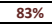

## C. First-Time, First-Year Admission

C1. Applications: First-time, First-year Students Provide the number of degree-seeking, first-time, first-year students who applied, were admitted, and enrolled (full- or part-time) in Fall 2023.

| Men                                                              | Women | Unknown |     |        |
| ---------------------------------------------------------------- | ----- | ------- | --- | ------ |
| Total first-time, first-year students who applied in Fall 2023   | 8,895 | 11,937  | 45  | 20,877 |
| Total first-time, first-year students admitted in Fall 2023      | 6,857 | 9,049   | 28  | 15,934 |
| Total first-time, first-year students enrolled in Fall 2023      | 1,682 | 2,069   | 0   | 3,751  |
| Full-time, first-time, first-year students enrolled in Fall 2023 | 1,673 | 2,059   | 0   | 3,732  |
| Part-time, first-time, first-year students enrolled in Fall 2023 | 9     | 10      | 0   | 19     |

## C2. Applications: First-Time, First-Year Wait-Listed Students

| In-State                                                        | Out-of-State | International | Total |        |
| --------------------------------------------------------------- | ------------ | ------------- | ----- | ------ |
| Total first-time, first-year (degree seeking) who applied       | 7,377        | 11,877        | 1,623 | 20,877 |
| Total first-time, first-year (degree seeking) who were admitted | 5,654        | 9,529         | 751   | 15,934 |
| Total first-time, first-year (degree seeking) enrolled          | 2,068        | 1,611         | 72    | 3,751  |

Students who met admission requirements but whose final admission was contingent on space availablity.

Do you have a policy of placing students on a waiting list? No C3. Admission Requirements: High School Completion Requirement Does your institution require high school completion for degree-seeking entering students?

High school diploma is required and GED is accepted

## C4. Admission Requirements: General College-Prepatory Program

Does your institution require OR recommend a general college-preparatory program for degree-seeking students?

Require Specify the distribution of academic high school course unites required and/or recommend of all or most degree-seeking students using Carnegie units (one unit equals one year of study or its equivalent). If you use a different system, please convert to Carnegie.

C.First-time Freshmen Admission Common Data Set 2023-24

| Units                           | Units                                        |     |     |
| ------------------------------- | -------------------------------------------- | --- | --- |
| Required                        | Recommended                                  |     |     |
| Total Academic Units            | 18                                           | 20  |     |
| English                         | 4                                            | 4   |     |
| Mathematics                     | 4                                            | 4   |     |
| Science                         | 3                                            | 4   |     |
|                                 | of Science Units, how many units must be lab | 3   | 4   |
| Foreign language Social Studies | 3                                            | 4   |     |
| History Computer Science        | 1                                            | 1   |     |
| Visual/Performing Arts          | 1                                            | 1   |     |
| Academic Electives              | 2                                            | 2   |     |

## C6. Basis For Selection: Open Admission Policy

Does your institution have an open admission policy, under which virtually all secondary school graduates or students with GED equivalency diplomas are admitted without regard to academic record, test scores, or other qualifications?

No

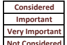

## C7. Basis For Selection: Relative Importance Of Factors In Admission Decisions

Please indicate the relative importance of each of the following academic and non-academic factors in your first-time, first-year degreeseeking general admission decisions (not including programs with specific criteria): _select from the dropdown menus._
ACADEMIC
Rigor of secondary school record **Considered** Class rank **Important** Academic Grade Point Average (GPA) **Very Important** Recommendations **Not Considered** Standardized test scores **Considered** Application essay **Not Considered**
NONACADEMIC
Interview **Not Considered** Extracurriculuar activities **Not Considered** Talent/ability **Not Considered** Character/personal qualities **Not Considered** First generation **Not Considered**
Alumni/ae relation **Not Considered**
Geographical residence **Not Considered** State residency **Not Considered** Religious affilitation/commitment **Not Considered** Volunteer work **Not Considered** Work experience **Not Considered** Level of applicant's interest Not Considered

## C8. Sat And Act Policies

Does your institution make use of SAT or ACT scores in admissions decisions for first-time, firstyear, degree-seeking applicants?

If yes, please select the appropriate response from the dropdown menus for each possible option below for admission for Fall 2025.

Please indicate which tests your institution uses for placement (e.g. state tests):

| Does your institution use applicants' test scores for academic advising? | Yes |
| ------------------------------------------------------------------------ | --- |

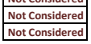

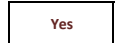

Institutional Exam State Exam

| SAT | CLEP | AP  |
| --- | ---- | --- |
| ACT |      |     |

C9. First-time, first-year profile: National standardized test scores (SAT/ACT)
Provide information for **all enrolled, degree-seeking, full-time and part-time, first-time, first-year students** enrolled in **Fall 2023**, including students who began studies during summer, international students/nonresidents, and students admitted under special arrangements. Report the percent and number of first-time, first-year students enrolled in Fall 2023 who submitted national standardized (SAT/ACT) test scores.

Percent Number

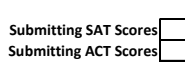

Submitting SAT Scores 5% 192 Submitting ACT Scores 84% 3,152
For each assessment listed below, report the score that represents the 25th percentile (the score that 25 percent of the firsttime, first-year population scored at or below) and the 75th percentile score (the score that 25 percent scored at or above).

Assessment

25th

Percentile

Score

SAT Composite (400 - 1600) 1105 1210 **1405** SAT Evidence-Based Reading and Writing (200 - 800) 570 610 690 SAT Math (200 - 800) 540 610 720 ACT Composite (0 - 36) 21 25 29

ACT Math (0 - 36) 19 24 27

ACT English (0 - 36) 21 24 30 ACT Reading (0 - 36) 22 26 31 ACT Science (0 - 36) 21 24 28

Percent of first-time, first-year students with scores in each range: Sum of each column should equal 100%.

| 50th                                |      |
| ----------------------------------- | ---- |
| Percentile Score (not used in BFCP) |      |
| 25th                                |      |
| Percentile Score                    | 75th |
| Percentile Score                    |      |

C.First-time Freshmen Admission Common Data Set 2023-24

| SAT EvidenceBased Reading |          |      |
| ------------------------- | -------- | ---- |
| Score Range               | SAT Math |      |
| and Writing               |          |      |
| 700-800                   | 21%      | 28%  |
| 600-699                   | 34%      | 26%  |
| 500-599                   | 37%      | 35%  |
| 400-499                   | 6%       | 8%   |
| 300-399                   | 2%       | 2%   |
| 200-299 Total             | 100%     | 100% |

| 1400-1600   | 26%         | 30 - 36  | 23%         |             |
| ----------- | ----------- | -------- | ----------- | ----------- |
| 1200-1399   | 28%         | 24 - 29  | 36%         |             |
| 1000-1199   | 38%         | 18 - 23  | 34%         |             |
| 800-999     | 6%          | 12 - 17  | 7%          |             |
| 600-799     | 3%          | 6 - 11   | 0%          |             |
| 400-599     | 0%          | Below 6  | 0%          |             |
| Total       | 100%        | Total    | 100%        |             |
| Score Range | ACT English | ACT Math | ACT Reading | ACT Science |
| 30 - 36     | 26%         | 12%      | 34%         | 19%         |
| 24 - 29     | 30%         | 40%      | 31%         | 39%         |
| 18 - 23     | 32%         | 32%      | 29%         | 36%         |
| 12 - 17     | 10%         | 17%      | 6%          | 6%          |
| 6 - 11      | 1%          | 0%       | 0%          | 0%          |
| Below 6     | 0%          | 0%       | 0%          | 0%          |
| Total       | 100%        | 100%     | 100%        | 100%        |

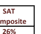

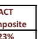

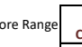

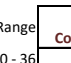

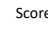

## C10. Class Rank Ranges

Percent of all degree-seeking, first-time, first-year students who had high school class rank within each of the following ranges (report information for those students from whom you collected high school rank information).

| Class Rank Range                                                                      | Percent |
| ------------------------------------------------------------------------------------- | ------- |
| Percent in top tenth of high school graduating class                                  | 24.4%   |
| Percent in top quarter of high school graduating class                                | 48.7%   |
| Percent in top half of high school graduating class                                   | 77.0%   |
| Percent in bottom half of high school graduating class                                | 23.0%   |
| Percent in bottom quarter of high school graduating class                             | 5.4%    |
| Percent of total first-time, first-year students who submitted high school class rank | 36.9%   |

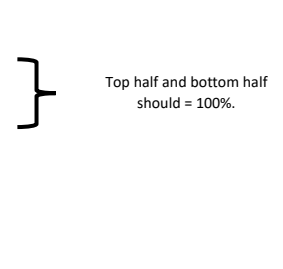

## C11. High School Grade Point Ranges

Percentage of all enrolled, degree-seeking, first-time, first-year students who had high school grade-point averages within each of the following ranges (using 4.0 scale).

$${\mathrm{Score~Range}}$$

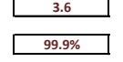

Percent of students who submitted

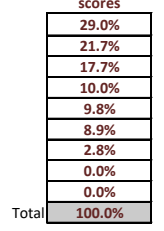

Percent who had GPA of 4.0 **29.0%** Percent who had GPA between 3.75 and 3.99 **21.7%** Percent who had GPA between 3.50 and 3.74 **17.7%** Percent who had GPA between 3.25 and 3.49 **10.0%**
Percent who had GPA between 3.00 and 3.24 **9.8%** Percent who had GPA between 2.50 and 2.99 **8.9%**
Percent who had GPA between 2.0 and 2.49 **2.8%** Percent who had GPA between 1.0 and 1.99 **0.0%** Percent who had GPA below 1.0 **0.0%** Average high school GPA of all degree-seeking, first-time, first-year students who submitted GPA: 3.6 Percent of total first-time, first-year students who submitted high school GPA: **99.9%**
C.First-time Freshmen Admission Common Data Set 2023-24

## C13. Application Fee

| Does your institution have an application fee?                    | Yes   |
| ----------------------------------------------------------------- | ----- |
| If yes, what is the amount of the application fee:                | $40.0 |
| If yes, can the fee be waived for applicants with financial need? | Yes   |

C14. Application Closing Date Does your institution have an application closing date? No C15. First-time, first-year student acceptance other than Fall Are first-time, first-year students accepted for terms other than the Fall? Yes C16. Admissions Notification to Applicants Are notifications to applicants of admission decision sent on a rolling basis? Yes What date do rolling notifications begin? _(MM/DD)_ **15-Aug**
C17. Reply Policy for Applicants What is your institution's reply policy for admitted applicants?

| No set date                                                 |         |
| ----------------------------------------------------------- | ------- |
| Deadline for housing deposits: (MM/DD)                      | 1-Apr   |
| Amount of housing deposit:                                  | $100.00 |
| Are housing deposits refundable if student does not enroll? | No      |

C18. Deferred Admission Does your institution allow students to postpone enrollment after admission? No C19. Early Admissions Does your institution allow high school students to enroll as full-time, first-time, first-year students one year or more before high school graduation?

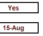

C20. Common Application (Questions Removed from CDS.)

## C21. Early Decision

Does your institution offer an early decision plan (an admission plan that permits students to apply and be notified of an admission decision well in advance of the regular notification date and that asks students to commit to attending if accepted) for first-time, first-year applicants for fall enrollment?

## C22. Early Action

Do you have a nonbinding early action plan whereby students are notified of an admission decision well in advance of the regular notification date but do not have to commit to attending your college?

C.First-time Freshmen Admission Common Data Set 2023-24

# D. Transfer Admission

## D1. Fall Applicants: Transfer Student Enrollment

Does your institution enroll transfer students? Yes If yes, may transfer students earn advanced standing credit by transferring credits earned from course work completed at other colleges/universities?

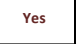

## D2. Fall Applicants: Student Counts

Provide the number of students who applied, were admitted, and enrolled as degree-seeking transfer students in Fall 2023. If your institution collects and reports non-binary gender data, please use the "Another Gender" category.

| Applicants     | Admitted   | Enrolled |       |
| -------------- | ---------- | -------- | ----- |
| Applicants     | Applicants |          |       |
| Men            | 1,722      | 1,311    | 902   |
| Women          | 2,180      | 1,454    | 847   |
| Another Gender | 0          | 0        | 0     |
| Total          | 3,902      | 2,765    | 1,749 |

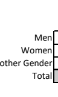

## D3. Enrollment Terms

Please indicate which terms for which transfer students may enroll: _(select all that apply)_

$$\left\lceil{\underline{{\boldsymbol{\cup}}}}\right\rceil\mathsf{F a}\left\|1\right\rceil$$

Spring

$$\boxed{\mathbb{V}}\;\mathsf{W i n t e r}$$
Summer

## D4. Transfer Applicants Minimum Credits

Must a transfer applicant have a minimum number of credits/courses completed or else must apply as an entering first-year student?

## D5. Requirements For Admission

Please indicate if the below items are required, recommended, or not of transfer students to apply for admission:
Select from the dropdown menu.

| High school transcript College transcript(s)                      |
| ----------------------------------------------------------------- |
| Essay or personal statement Interview Standardardized test scores |
| Statement of good standing from prior institution(s)              |

| Required of Some Required of All Not Required Not Required Required of Some Required of All |
| ------------------------------------------------------------------------------------------- |

Office of Institutional Research and Effectiveness

## D6. Minimum High School Gpa Required

If a minimum high school grade point average is required of transfer applicants, specificy (on a 4.0) scale:
GPA Required:
D7. Minimum College GPA Required If a minimum college grade point average is required of transfer applicants, specificy (on a 4.0) scale:

D8. List any other application requirements specific to transfer applicants:
$40 Application Fee GPA Required:

## D9. Application Specific Dates

List application priority, closing, notification, and candidate reply dates for transfer students. If applications are reviewed on a continuous or rolling basis, place a check mark in the "Rolling Admission" column. Use MM/DD format.

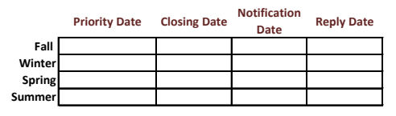

Date Reply Date **Rolling Admission**

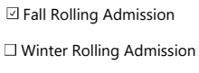

Spring Rolling Admission

Summer Rolling Admission

## D10. Open Admission Policy

Does an open admission policy, if reported, apply to transfer students?

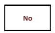

D11. Additional Requirements Please describe any additional requirements for transfer students, if applicable:
D12. Lowest Grade Allowable for Transfer Credit Report the lowest grade earned for any course that may be transferred for credit:
Lowest grade: C \*

D13. Maximum Credits Transferred to two-year institutions Report the maximum number of credits or courses that may be transferred from a two-year institution:

Number: **62 \*\*** Unit Type: **Credit(s)**
D14. Maximum Credits Transferred to four-year institutions Report the maximum number of credits or courses that may be transferred from a four-year institution:
Number: **93 \*\*** Unit Type: **Credit(s)**

## D15. Minimum Credits To Earn Associate Degree

Report the minimum number of credits that transfer students must complete at your institution to earn an associate degree:
Number:

D16. Minimum Credits to Earn Bachelor's Degree Report the minimum number of credits that transfer students must complete at your institution to earn a bachelor's degree:
Number: 31

## D17: Other Credit Policies

Please describe any other transfer credit policies: ( \* ) Colleges and schools may allow the transfer of credits with a grade of D at their discretion [MSU AOP 12.12]. ( \*\* ) For curricula requiring 124 total credit hours. The last half of total hours applied toward graduation must be earned in a senior college, and at least the last 25% of semester credit hours of course work taken to fulfill degree requirements must be completed at Mississippi State University [MSU AOP 12.11].

## D18: Military/Veteran Transfer Credits

Does your institution accept the following military/veteran transfer credits: _(select all that apply)_
American Council on Education (ACE) DANTES Subject Standardized Tests (DSST)
College Level Examination Program (CLEP)

## D19: Maximum Credits Transferred - Ace

Report the maximum number of credits or courses that may be transferred based on military education evaluated by the American Council on Education (ACE):
Number: 31 Unit Type: **Credit(s)**
D20: Maximum Credits Transferred - CLEP, DSST
Report the maximum number of credits or courses that may be transferred based on Department of Defense supported prior learning assessments (College Level Examination Program (CLEP) or DANTES Subject Standardized Tests (DSST)):

$$\vdots\quad\mathbf{31}$$
Number: 31 Unit Type: **Credit(s)**
D21: Published Transfer Policies Yes Are the military/veteran credit transfer policies published on your website? If yes, please provide the URL where the policy can be located:

# D22: Unique Transfer Policies

Please describe other military/veteran transfer credit policies unique to your institution:

## E. Academic Offerings And Policies E1. Special Study Options

Please identify the programs available at your institution. Refer to the glossary for definitions. Select all that apply.

Accelerated Comprehensive transition and postsecondary program for students with intellectual disabilities Honors program

| Independent study |
| ----------------- |

| Cross-registration                  | Internships                     |
| ----------------------------------- | ------------------------------- |
| Distance learning                   | Liberal arts/career combination |
| Double major                        | Student-designed major          |
| Dual enrollment                     | Study abroad                    |
| English as a Second Language (ESL)  | Teacher certification program   |
| Exchange student program (domestic) | Undergraduate Research          |
| External degree program             | Weekend college                 |

Other

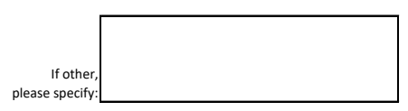

## E2. Removed From The Cds.

E3. Required Coursework for Graduation Please indicate the areas in which all, or most, students are required to complete some course work prior to graduation: Select all that apply.

Arts / fine arts

| Computer literacy |
| ----------------- |

English (including composition) Foreign languages History Humanities Intensive Writing

| Mathematics |
| ----------- |

| Philosophy Physical Education |
| ----------------------------- |

Sciences (biological or physical) Social Science Other

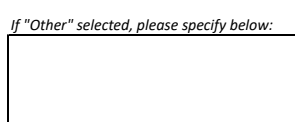

E. Academic Offerings-Policies Common Data Set 2023-24

# F. Student Life

## F1. First-Time, First-Year Degree-Seeking Students And Undergraduates Enrolled

Please complete the table below with the percentages or average age of first-time, first-year degree-seeking students and degreeseeking undergraduates enrolled in Fall 2023 who fit into the following categories:

| First-time,                                                                                                 |                |       |
| ----------------------------------------------------------------------------------------------------------- | -------------- | ----- |
| First-year Students                                                                                         | Undergraduates |       |
| Percent who are from out of state (exclude international/ non-residents from the numerator and denominator) | 42.9%          | 32.2% |
| Percent of men who join fraternities                                                                        | 27.3%          | 21.1% |
| Percent of women who join sororities                                                                        | 36.6%          | 26.3% |
| Percent who live in college-owned, -operated, or -affiliated housing                                        | 94.9%          | 33.6% |
| Percent who live off campus or commute                                                                      | 5.1%           | 66.4% |
| Percent of students age 25 or older                                                                         | 0.1%           | 8.1%  |
| Average age of full-time students                                                                           | 18             | 21    |
| Average age of all students (full-time and part-time)                                                       | 18             | 21    |

## F2. Activities Offered

Please identify all programs available at your institution.

| Campus Ministries                  | Literary magazine | Student government                    |
| ---------------------------------- | ----------------- | ------------------------------------- |
| Choral groups                      | Marching band     | Student newspaper                     |
| Concert band                       | Model UN          | Student-run film society              |
| Dance                              | Music ensembles   | Symphony orchestra Television station |
| Drama/theater                      | Opera             |                                       |
| International Student Organization | Pep band          | Yearbook                              |
| Jazz band                          | Radio station     |                                       |

F3. ROTC (program offered in cooperation with Reserve Officers' Training Corps) _select all that apply._
Army ROTC is offered:
On Campus At cooperating institution If at cooperating institution, please list institution below:
Marine Option On Campus At cooperating institution Naval ROTC is offered: If at cooperating institution, please list institution below: Air Force ROTC is offered:
On Campus At cooperating institution If at cooperating institution, please list institution below:
F4. Housing Please check all types of college-owned, -operated, or -affiliated housing available for undergraduates at your institution.

Apartments for married students Apartments for single students Coed residence halls Men's residence halls Special housing for international students Special housing for students with disabilities Cooperative housing Theme housing Fraternity/sorority housing Women's residence halls Living Learning Communities Other Housing Options If selected "Other Housing Options", please specify below:
Co-Residential Housing

# G. Annual Expenses

## G0. Net Price Calculator Url

Please provide the URL of your instititution's net price calculator:
https://www.sfa.msstate.edu/cost/
For the following sections, please provide 2024-2025 academic year costs of attendance for the following categories that are applicable to your institution. If your institution's 2024-2025 academic year costs of attendance are not available at this time, please select the checkbox below and enter the approximate date (i.e. MM/DD) when your institution's final 2024-2025 academic year costs of attendance will be available.

Tuition and Fee Data Provided are: **Firm and Final**
2024-2025 academic costs not currently available Approximate date costs will be available: **July-24**

## G1. Undergraduate, Full-Time Tuition, Required Fees, Food And Housing

List the typical tuition, required fees, and food and housing for a full-time undergraduate student for the **full 2024-2025** academic year. (30 semester hours or 45 quarter hours for institutions that derive annual tuition by multiplying credit hour cost by number of credits).

A full academic year refers to the period of time generally extending from September to June; usually equated to two semesters, two trimesters, three quarters, or the period covered by a four-one-four plan.

Food and housing is defined as double occupancy and 19 meals per week or the maximum meal plan.

**Required fees** include only charges that all full-time students must pay that are not included in tuition (e.g., registration, health, or activity Do not include optional fees (e.g., parking, laboratory use).

| First-Year                              | Undergraduate      |         |        |
| --------------------------------------- | ------------------ | ------- | ------ |
| PUBLIC INSTITUTION                      | Tuition: In-state: | $9,665  | $9,665 |
| Tuition: Out-of-state:                  | $26,430            | $26,430 |        |
| Tuitition: International (non-resident) | $25,294            | $25,294 |        |
| FOR ALL INSTITUTIONS                    | Required Fees:     | $150    | $150   |
| Food and Housing (on-campus):           | $12,293            | $12,293 |        |
| Housing Only (on-campus):               | $7,707             | $7,707  |        |
| Food Only (on-campus meal plan):        | $4,586             | $4,586  |        |

## G2. Credits Per Term

Please enter the number of credits per term a student can take for the stated full-time tuition:

Minimum number of credits: **12.0**

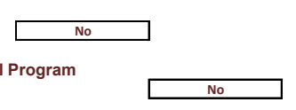

Maximum number of credits:
G3. Tuition and Fee Variance by Year of Study Do tuition and fees vary by year of study (e.g. sophomore, junior, senior)? No G4. Tuition and Fee Variance by Undergraduate Instructional Program Do tuition and fees vary by undergraduate instructional program? No G. Annual Expenses Common Data Set 2023-24

## G5. Estimated Expenses For Typical Full-Time Undergraduates Please Provide Estimated Expenses For A Typical Full-Time Undergraduate Student:

| Residents           | Commuters            | Commuters |        |
| ------------------- | -------------------- | --------- | ------ |
| (living at home)    | (not living at home) |           |        |
| Books and supplies: | $1,200               | $1,200    | $1,200 |
| Housing only:       | $7,930               |           |        |
| Food only:          | $4,586               | $4,586    |        |
| Transportation:     | $2,808               | $2,808    | $2,808 |
| Other expenses:     | $3,338               | $3,338    | $3,338 |

## G6. Undergraduate Per-Credit-Hour Charges\*- (Tuition Only)

Please enter the undergraduate per-credit-hour charges (tuition only) in the applicable institution type and segment of students:

| PUBLIC INSTITUTIONS                                                           | $402.75 $1,107.75 $1,107.75 |
| ----------------------------------------------------------------------------- | --------------------------- |
| In-state students, per-credit-hour charge (tuition only):                     |                             |
| Out-of-state students, per-credit-hour charge (tuition only):                 |                             |
| International (non-resident) students, per-credit-hour charge (tuition only): |                             |

\*Source: https://www.controller.msstate.edu/accountservices/tuition G. Annual Expenses Common Data Set 2023-24

## H. Financial Aid H1. Aid Awarded To Enrolled Undergraduates

Enter total dollar amounts awarded to enrolled full-time and less than full-time degree-seeking undergraduates (using the same cohort reported in CDS Question B1, "total degree-seeking" undergraduates) in the following categories.

Indicate the academic year for which data are reported for items H1, H2, H2A, and H6 below:

## 2022-2023 Final

Which needs-analysis methodology does your institituion use in awarding institutional aid? _(formerly CDS - H3)_

| Federal methodology (FM)                                                                                                                                                      | Non-Need-Based (Exclude non-needbased aid use to meet need). |                |                |
| ----------------------------------------------------------------------------------------------------------------------------------------------------------------------------- | ------------------------------------------------------------ | -------------- | -------------- |
| Federal                                                                                                                                                                       | $31,001,530.00                                               |                |                |
| State - all states, not only the state in which your institution is located                                                                                                   | $10,799,403.00                                               | $2,305,519.00  |                |
| Need-Based                                                                                                                                                                    |                                                              |                |                |
| (Include non-need based aid use to meet need).                                                                                                                                |                                                              |                |                |
| Instititutional - Endowed scholarships, annual gifts and tuition funded grants, awarded by the college, excluding athletic aid and tuition waivers (which are reported below) |                                                              |                |                |
| Scholarships / Grants                                                                                                                                                         | $40,655,467.00                                               | $30,340,312.00 |                |
| Scholarships/grants from external sources (e.g. Kiwanis, National Merit) not awarded by                                                                                       | $7,452,458.00                                                | $2,589,272.00  |                |
| the college                                                                                                                                                                   | Total Scholarships/Grants                                    | $89,908,858.00 | $35,235,103.00 |
| Student loans from all sources (excluding parent loans)                                                                                                                       | $80,370,909.00                                               | $19,472,378.00 |                |
| Federal Work-Study                                                                                                                                                            | $1,539,187.73                                                |                |                |
| State and other (e.g., institutional) workstudy/employment (Note: excludes Federal Work/Study captured above) Total Self-Help                                                 | $81,910,096.73                                               | $19,472,378.00 |                |
| Parent Loans                                                                                                                                                                  | $13,201,396.00                                               | $8,870,269.00  |                |
| Tuition Waivers                                                                                                                                                               | $63,221,514.81                                               |                |                |
| Athletic Awards                                                                                                                                                               | $10,446,762.56                                               |                |                |
| Self Help MISC.                                                                                                                                                               |                                                              |                |                |

## H2. Number Of Enrolled Students Awarded Aid

List the number of degree-seeking full-time and less-than-full-time undergraduates who applied for and were awarded financial aid from any source.

| Full-Time, First-Time, Full-Time Undergrad.                                                                                                                                                                                                                                                                      | Less Than FullTime Undergrad. |            |           |
| ---------------------------------------------------------------------------------------------------------------------------------------------------------------------------------------------------------------------------------------------------------------------------------------------------------------- | ----------------------------- | ---------- | --------- |
| First-Year                                                                                                                                                                                                                                                                                                       | (Include Freshman)            |            |           |
| A. Number of degree-seeking undergraduate students (CDS Item B1 if reporting on Fall 2023                                                                                                                                                                                                                        | 3367                          | 16621      | 1684      |
| cohort) B. Number of students in line (A) who applied for need-based financial aid                                                                                                                                                                                                                               | 2998                          | 12665      | 881       |
| C. Number of students in line (B) who were determined to have financial need                                                                                                                                                                                                                                     | 2416                          | 10555      | 747       |
| D. Number of students in line (C) who were awarded any financial aid                                                                                                                                                                                                                                             | 2383                          | 10227      | 616       |
| E. Number of students in line (D) who were awarded any need-based scholarship or grant aid                                                                                                                                                                                                                       | 2330                          | 9487       | 432       |
| F. Number of students in line (D) who were awarded any need-based self-help aid                                                                                                                                                                                                                                  | 1,218                         | 5,934      | 456       |
| G. Number of students in line (D) who were awarded any non-need-based scholarship or grant                                                                                                                                                                                                                       | 487                           | 1,196      | 18        |
| aid H. Number of students in line (D) who need was fully met (exclude PLUS loans, unsubsidized loans,                                                                                                                                                                                                            | 488                           | 1,861      | 51        |
| and private alternative loans) I. On average, the percentage of need that was met of students who were awarded any need-based aid. Exclude any aid that was awarded in excess of need as well as any resources that were awarded to replace EFC (PLUS loans, unsubsidized loans, and private alternative loans). | 57.8%                         | 55.3%      | 41.4%     |
| J. The average financial aid package of those in line (D). Exclude any resources that were awarded to                                                                                                                                                                                                            | $15,977.87                    | $14,760.42 | $8,992.72 |
| replace EFC (PLUS loans, unsubsidized loans, and private alternative loans). K. Average need-based scholarship or grant award of those in line (E)                                                                                                                                                               | $9,212.13                     | $8,758.14  | $4,374.08 |
| L. Average need-based self-help award (excluding PLUS loans, unsubsidized loans, and private                                                                                                                                                                                                                     | $2,844.14                     | $3,679.76  | $3,420.68 |
| alternative loans) of those in line (F) M. Average need-based loan (excluding PLUS loans, unsubsidized loans, and private alternative loans) of                                                                                                                                                                  | $3,251.73                     | $3,425.34  | $3,356.11 |
| those in line (F) who were awarded a need-based loan                                                                                                                                                                                                                                                             |                               |            |           |

## H2A. Number Of Enrolled Students Awarded Non-Need-Based Scholarships And Grants

List the number of degree-seeking full-time and less-than-full-time undergraduates who had no financial need and who were awarded institutional non-need-based scholarship or grant aid.

| Full-Time, First-Time, Full-Time Undergrad.                                                                                                                                                                  | Less Than FullTime Undergrad. |            |           |
| ------------------------------------------------------------------------------------------------------------------------------------------------------------------------------------------------------------ | ----------------------------- | ---------- | --------- |
| First-Year                                                                                                                                                                                                   | (Include Freshman)            |            |           |
| N. Number of students in line (A) who had no financial need and who were awarded institutional non-need-based scholarship or grant aid (exclude those who were awarded athletic awards and tuition benefits) | 575                           | 2,780      | 81        |
| O. Average dollar amount of institutional non-needbased scholarship and grant aid awarded to                                                                                                                 | $6,383.69                     | $6,056.10  | $3,065.09 |
| students in line (N) P. Number of students in line (A) who were awarded an instutional non-need-based athletic scholarship                                                                                   | 85                            | 396        | 1         |
| or grant Q. Average dollar amount of institutional non-needbased athletic scholarships and grants awarded to                                                                                                 | $23,701.66                    | $20,830.11 | $1,500.00 |
| students in line (P)                                                                                                                                                                                         |                               |            |           |

## H4. 2022 Undergraduate Class

Provide the number of students in the 2023 undergraduate class who started at your institution as first-time students and received a bachelor's degree between July 1, 2021 and June 30, 2022. Exclude students who transferred into your institution.

2,318

## H5. Number/Percent Borrowers And Average Borrowed Amount

Provide the number and percent of students in class (defined in H4 above) borrowing from federal, non-federal, and any loan sources, and the average (or mean) amount borrowed in the table below.

| Average perundergraduateborrower cumulative principal borrowed from the types of loans specific in the first column (nearest $1)                                                                                                              |                                                                                                                                                                                                                                  |     |         |
| --------------------------------------------------------------------------------------------------------------------------------------------------------------------------------------------------------------------------------------------- | -------------------------------------------------------------------------------------------------------------------------------------------------------------------------------------------------------------------------------- | --- | ------- |
| A. Any loan program: Federal Perkins, Federal Stafford Subsidized and Unsubsidized, institutional, state, private loans that your institution is aware of, etc. Include both Federal Direct Student Loans and Federal Family Education Loans. | Number in the class (defined in H4 above) who borrowed from the types of loans specific in the first column Percent of the class (defined above) who borrowed from the types of loans specified in the first column (nearest 1%) |     |         |
| Source/Type of Loan                                                                                                                                                                                                                           | 1,187                                                                                                                                                                                                                            | 51% | $24,254 |
| B. Federal loan programs: Federal Perkins, Federal Stafford Subsidized and Unsubsidized. Include both                                                                                                                                         | 1,144                                                                                                                                                                                                                            | 49% | $18,650 |
| Federal Direct Student Loans and Federal Family Education Loans. C. Institutional loan program                                                                                                                                                | 46                                                                                                                                                                                                                               | 2%  | $24,930 |
| D. State loan programs E. Private student loans made by a bank or lender                                                                                                                                                                      | 208                                                                                                                                                                                                                              | 9%  | $30,321 |

H6. Aid to Undergraduate Degree-Seeking Nonresidents Report numbers and dollar amounts for the same academic year as checked in item H1.

H1 Response: _2022-2023 Final_ Indicate your instititution's policy regarding institutional scholarship and grant aid for undergraduate degree-seeking nonresidents:
Institutional need-based scholarship or grant aid is available Institutional non-need-based scholarship or grant aid is available Institutional scholarship and grant aid is not available If institutional financial aid is available for undergraduate degree-seeking nonresidents, provide the number of undergraduate degree-seeking nonresidents who were awarded need-based or non-need-based aid: Average dollar amount of institutional financial aid awarded to undergraduate degree-seeking nonresidents:

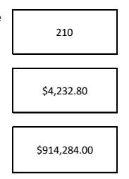

Total dollar amount of institutional financial aid awarded to undergraduate degree-seeking nonresidents:
H7. Process for Nonresident First-Year Students Select all financial aid forms that nonresident first-year financial aid applicants must submit:
Institution's own financial aid form CSS Profile Other; please specify.

## H8. Process For First-Year Students

Select all financial aid forms domestic first-year financial aid applicants must submit:
FAFSA Institution's own financial aid form CSS Profile Other: **General Scholarship Application**
State aid form Other; please enter below.

 Business/Farm Supplement

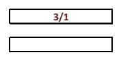

## H9. Filing Dates For First-Year Students

Does institution have a deadline for filing required financial aid forms for first-year students? No Select "no" if there is no deadline and applications are processed on a rolling basis.

Priority date for filing required financial aid forms: (MM/DD) 3/1

| Deadline for filing required financial aid forms: (MM/DD) |
| --------------------------------------------------------- |

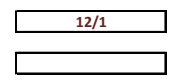

Office of Institutional Reseach and Effectiveness

## H10. Notification Dates For First-Year Students

Please enter the date for only one response below based on whether students are notified on a certain date or notified on a rolling basis.

Students are notificed on or about (date): (MM/DD) **12/1**
Students are notified on a rolling basis starting (date): (MM/DD)

## H11. Reply Dates For First-Year Students

Students must reply by (date): (MM/DD) 5/1 or within (number) of weeks of notification:
H12. Types of Aid Available - Loans Please select all types of aid available to undergraduates at your institution:
Direct Subsidized Stafford Loans Direct Unsubsidized Stafford Loans Direct PLUS Loans Federal Perkins Loans Federal Nursing Loans

 State Loans College/University loans from institutional funds Other Please specify:
H13. Types of Aid Available - Need-Based Scholarships and Grants Please select all types of aid available to undergraduates at your institution:
Federal Pell SEOG
State scholarship/grants College/University scholarship or grant aid from institutional funds United Negro College Fund Federal Nursing Scholarship Private scholarships Other

| Academics Alumni affiliation Art |
| -------------------------------- |

Please specify:

## H14. Criteria Used In Awarding Institutional Aid

Please select all criteria used in awarding non-need based institutional aid:
Music/drama Athletics

| Religious affiliation State/district residency |
| ---------------------------------------------- |

Minority status

| Job skills ROTC Leadership |
| -------------------------- |

H14. Criteria Used in Awarding Institutional Aid Please select all criteria used in awarding need-based institutional aid:

| Academics          | Job skills      | Music/drama                                    |
| ------------------ | --------------- | ---------------------------------------------- |
| Alumni affiliation | ROTC            | Religious affiliation State/district residency |
| Art                | Leadership      |                                                |
| Athletics          | Minority status |                                                |

## H15. Affordable Policies

If your institution has recently implemented any major financial aid policy, program, or iniative to make your institution more affordable to incoming students such as replacing loans with grants, or waiving costs for families below a certain income level, please provide the details below:

- There was not an increase to the tuition rate for the year 2020-2021, from the prior year. - The winter session tuition for 2020-2021 was discounted in order to help students be able to take advantage of that opportunity. - A special circumstance initiative that included contacting our students to inform them of assistance for those who may have had a change in financial standing.

- Offered an Educational Savings Grant Program for current and future students from low-income families, who can deposit up to $625 into a trustee savings account that will be transferred to their student account at the end of the program. After six months of participation the the Educational Savings Grant Program, the student's savings would be matched four to one in grant funds, up to $2,500.

## I. Instructional Faculty And Class Size

I1. Instructional Faculty by Category

Please report the number of instructional faculty members in each category for Fall 2023. Include faculty who are on your institution's payroll on the census date your institution uses for IPEDS/AAUP.

| payroll on the census date your institution uses for IPEDS/AAUP.                                                            | Full-Time | Part-Time | Total |
| --------------------------------------------------------------------------------------------------------------------------- | --------- | --------- | ----- |
| A. Total number of instructional faculty                                                                                    | 1081      | 377       | 1458  |
| B. Total number who are members of minority groups                                                                          | 227       | 88        | 315   |
| C. Total number who are women                                                                                               | 489       | 211       | 700   |
| D. Total number who are men                                                                                                 | 592       | 166       | 758   |
| E. Total number who are international (non-residents)                                                                       | 66        | 9         | 75    |
| F. Total number with docorate, or other terminal degrees                                                                    | 892       | 149       | 1041  |
| G. Total number whose highest degree is a master's degree but not a terminal master's                                       | 176       | 150       | 326   |
| H. Total number whose highest degree is a bachelor's                                                                        | 8         | 61        | 69    |
| I. Total number whose highest degree is unknown or other                                                                    | 5         | 17        | 22    |
| J. Total number in stand-alone graduate/professional programs in which faculty teach virtually only graduate-level students | 0         | 0         | 0     |
| NOTE: Rows F, G, H and I should equal row A.                                                                                |           |           |       |

## I2. Student To Faculty Ratio

Report the Fall 2023 ratio of full-time equivalent students (full-time plus 1/3 part time) to full-time equivalent instructional faculty (full time plus 1/3 part time). In the ratio calculations, exclude both faculty and students in stand-alone graduate or professional programs such as medicine, law, veterinary, dentistry, social work, business, or public health in which faculty teach virtually only graduate level students. Do not count undergraduate or graduate student teaching assistants as faculty.

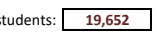

Ratio is based on number of students:

## I3. Undergraduate Class Size

In the table below, please report information about the size of classes and class sections offered in the Fall 2023 term.

Class Sections: A class section is an organized course offered for credit, identified by discipline and number, meeting at a stated time or times in a classroom or similar setting, and not a subsection such as a laboratory or discussion session. Undergraduate class sections are defined as any sections in which at least one degree-seeking undergraduate student is enrolled for credit. Exclude distance learning classes and noncredit classes and individual instruction such as dissertation or thesis research, music instruction, or one-to-one readings. Exclude students in independent study, co-operative programs, internships, foreign language taped tutor sessions, practicums, and all students in one-on-one classes. Each class section should be counted only once and should not be duplicated because of course catalog cross-listings.

Class Subsections: A class subsection includes any subsection of a course, such as laboratory, recitation, and discussion subsections that are supplementary in nature and are scheduled to meet separately from the lecture portion of the course. Undergraduate subsections are defined as any subsections of courses in which degree-seeking undergraduate students enrolled for credit. As above, exclude noncredit classes and individual instruction such as dissertation or thesis research, music instruction, or one-to-one readings. Each class subsection should be counted only once and should not be duplicated because of cross-listings. Using the above definitions, please report for each of the following class-size intervals the number of class sections and class subsections offered in Fall 2023. For example, a lecture class with 800 students who met at another time in 40 separate labs with 20 students should be counted once in the "100+" column in the class section column and 40 times under the "20-29" column of the class subsections table.

Number of class sections with undergraduates enrolled --
Undergraduate Class Size (provide numbers)

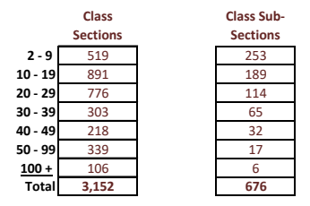

# J. Disciplinary Areas Of Degrees Conferred

## Degrees Conferred Between July 1, 2022 And June 30, 2023.

For each of the following discipline areas, provide the percentage of diplomas/certificates, and bachelor's degrees awarded. To determine the percentage, use majors, not headcount (e.g., students with one degree but a double major will be represented twice). Calculate the percentage from your institution's IPEDS Completions by using the sum of 1st and 2nd majors for each CIP code as the numerator and the sum of the Grand Total by 1st Majors and the Grand Total by 2nd major as the denominator. If you prefer, you can compute the percentages using 1st majors only.

| CIP 2020                                        |                       |            |                       |
| ----------------------------------------------- | --------------------- | ---------- | --------------------- |
| Category                                        | Diploma/ Certificates | Bachelor's | Categories to Include |
| Agriculture                                     | 6.1                   | 1          |                       |
| Natural resources and conservation              | 2.6                   | 3          |                       |
| Architecture                                    | 1.6                   | 4          |                       |
| Communication/journalism                        | 3.2                   | 9          |                       |
| Computer and information sciences               | 2.2                   | 11         |                       |
| Education                                       | 8.3                   | 13         |                       |
| Engineering                                     | 17.0                  | 14         |                       |
| Engineering technologies                        | 1.7                   | 15         |                       |
| Foreign languages, literatures, and linguistics | 0.7                   | 16         |                       |
| Family and consumer sciences                    | 1.9                   | 19         |                       |
| English                                         | 0.4                   | 23         |                       |
| Liberal arts/general studies                    | 1.3                   | 24         |                       |
| Biological/life sciences                        | 6.1                   | 26         |                       |
| Mathematics and statistics                      | 0.7                   | 27         |                       |
| Interdisciplinary studies                       | 6.5                   | 30         |                       |
| Parks and recreation                            | 5.9                   | 31         |                       |
| Philosophy and religious studies                | 0.2                   | 38         |                       |
| Physical sciences                               | 1.9                   | 40         |                       |
| Psychology                                      | 6.9                   | 42         |                       |
| Public administration and social services       | 0.8                   | 44         |                       |
| Social sciences                                 | 3.1                   | 45         |                       |
| Visual and performing arts                      | 1.2                   | 50         |                       |
| Health professions and related programs         | 0.2                   | 51         |                       |
| Business/marketing                              | 19.0                  | 52         |                       |
| History                                         | 0.7                   | 54         |                       |
| Other                                           |                       |            |                       |

Updated: 2/13/2024 J. Degrees Conferred Common Data Set 2023-24
